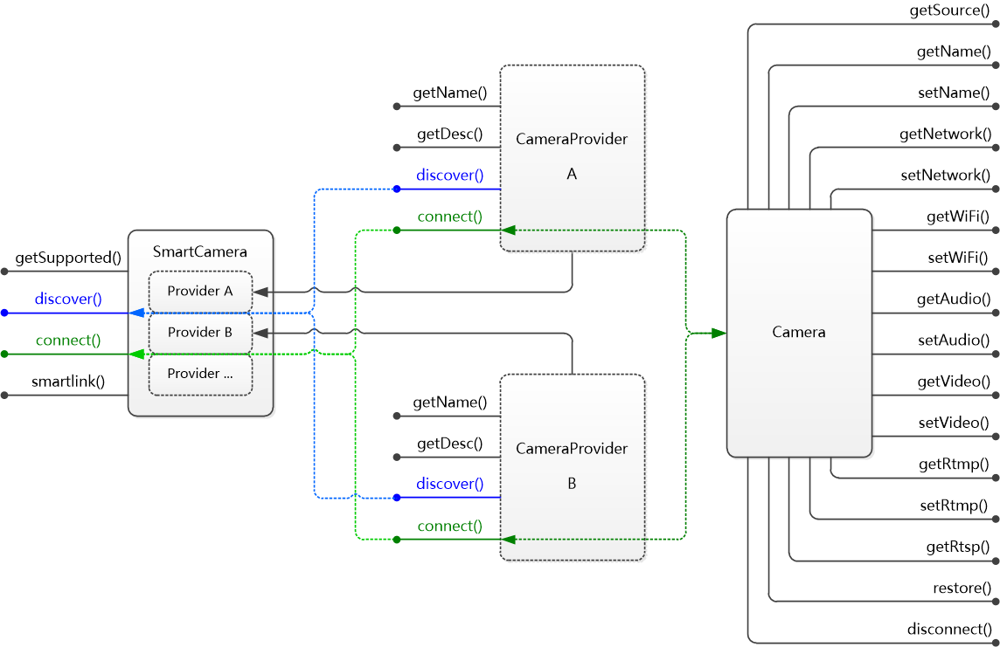

# SmartCamera_win
适用于 Windows 平台的智能摄像头 SDK，支持 SmartLink 智能配网、局域网发现，和摄像头的网络配置、音视频参数设置，以及 RTMP 推流设置等。

SmartCamera 旨在提供简单易用的 SDK，兼容包括互联网摄像头、监控摄像头等各种摄像头设备，实现对摄像头管理和配置的智能化和移动化。

## 认识 SmartCamera
- SDK 主体结构：

- SmartCamera，SmartCamera 是一个单例实例，是使用 SDK 的总入口
- CameraProvider，CameraProvider 是一个接口，针对不同厂商的摄像头，提供不同的 CameraProvider 实现
- Camera，Camera 同样是一个接口，针对不同厂商提供对应的实现

## 使用 SmartCamera
- 下载 include 和 lib 文件夹，并导入到工程。
- 范例代码：
```c++
SmartCamera*	g = SmartCamera_getInstance();
ArrayList<CameraProvider*>*	providers = g->getSupported();
		
g->discover(providers, this, 5);

providers->destroy();


virtual void cameraDiscoverAbort(CameraProviderSource* source)
{
    ATLTRACE("ABORT: %s\r\n", source->getName());
}

virtual void cameraDiscoverTimeout(CameraProviderSource* source)
{
    ATLTRACE("TIMEOUT: %s\r\n", source->getName());
}

virtual void cameraDiscovered(CameraSource* source)
{
    ATLTRACE(TEXT("FOUND: %s\n"), source->getUrl());
    
    SmartCamera*	g = SmartCamera_getInstance();
    Camera*		camera = g->connect(source->getUrl());
    
    if(camera)
    {
        NETWORK_CONFIG*	network = camera->getNetwork();

        if(network)
            ATLTRACE(TEXT("DHCP: %s, IP: %s, MASK: %s, GATEWAY: %s, DNS1: %s, DNS2: %s\n"), network->dhcp ? "YES" : "NO", network->ip, network->mask, network->gateway, network->dns1, network->dns2);

        ....
    }
}
```


## 反馈及意见
当你遇到任何问题时，可以通过在 GitHub 的 repo 提交 issues 来反馈问题，请尽可能的描述清楚遇到的问题，如果有错误信息也一同附带，并且在 Labels 中指明类型为 bug 或者其他。
[通过这里查看已有的 issues 和提交 Bug](https://github.com/azhisoft/SmartCamera_win/issues)
